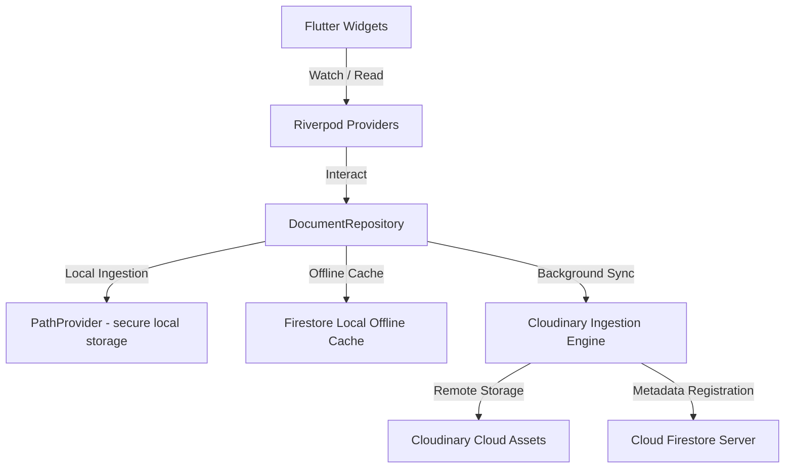

# 🛡️ VaultMaster (Nexus Archive)

[](https://flutter.dev)
[](https://riverpod.dev)
[](https://firebase.google.com)
[](https://cloudinary.com)
[](#)
[](#)

> **VaultMaster** is a secure, offline-first "pocket filing cabinet" mobile application. Designed for professionals, freelancers, and students, it allows users to smartly scan physical documents, import digital files, organize them into customizable folders, protect sensitive assets behind device-level biometrics, and seamlessly synchronize them to the cloud.

---

## 📚 Senior Developer Documentation Suite & Web Ecosystem

VaultMaster features an exhaustive, production-grade **5-Part Senior Developer Documentation Suite** stored directly in the `docs/` workspace, along with a zero-install **Pixel-to-Pixel Interactive Web Sandbox**:

* 📄 **[01_prd.md](file:///E:/Projects/vaultmaster/docs/01_prd.md) — Product Requirements Document (PRD)**: Executive summary, target personas & Mermaid mindmaps, prioritized features (P0/P1/P2), and 10+ detailed user stories with strict `Given / When / Then` acceptance criteria.
* 📐 **[02_trd.md](file:///E:/Projects/vaultmaster/docs/02_trd.md) — Technical Requirements Document (TRD)**: System architecture overview, exact tech stack versions (`Flutter >=3.22`, `SQLCipher`, `ML Kit`), directory tree, database/TypeScript data schemas, security rules, and offline cloud strategies.
* 🧭 **[03_user_flows.md](file:///E:/Projects/vaultmaster/docs/03_user_flows.md) — User Flows & Screen Map**: Mermaid state graphs across all screens (`Welcome` rotating wheel, `Login`, `Splash` icon, `Dashboard`, `Scanner`, `PIN Vault`) plus end-to-end exception/edge case flowcharts.
* 🚀 **[04_project_plan.md](file:///E:/Projects/vaultmaster/docs/04_project_plan.md) — Project Implementation Plan**: Phased task checklists (`[x]`), hourly estimates (`120 Hours total`), milestone progress table, and Mermaid dependency roadmap.
* 🧪 **[05_testing_plan.md](file:///E:/Projects/vaultmaster/docs/05_testing_plan.md) — QA & Testing Plan**: Testing pyramid strategy, detailed acceptance test matrices across Unit/Widget/Integration layers, and complete Playwright E2E scenarios.
* 🌐 **[Interactive Web Sandbox (`demo.html`)](file:///E:/Projects/vaultmaster/website/demo.html)**: Live Vanilla HTML/JS browser mockup (`https://aliahmedoo5.github.io/VaultMaster/demo.html`) replicating authentic startup animations (`WelcomeScreen` rotating dial & `SplashScreen` scaling icon) without requiring APK installation.

---

## ✨ Core Features

* **📸 Smart Document Scanner**
  Powered by **Google ML Kit Document Scanner** for real-time edge detection, perspective correction, tilt adjustment, and multi-page PDF compilation.
* **📂 Smart Categorization & Ingestion**
  Import files (`PDF`, `DOCX`, `XLSX`, `TXT`, `PNG`, `JPG`) from local device directories and automatically categorize them with dynamic tags and visual cues.
* **🔒 Biometric Security Vault**
  An encrypted, high-security space locked behind native device biometrics (**FaceID/Fingerprint**) or security **PIN** using OS keychain access.
* **⚡ Robust Offline-First Engine**
  Fully operational without internet access. Metadata and files are stored securely on-device with background synchronization that uploads assets to Cloudinary and registers them to Cloud Firestore once connectivity is restored.
* **📤 Native Share Integration**
  Instantly share documents via email, WhatsApp, Slack, or Google Drive via direct integration with native iOS & Android Share Sheets.

---

## 🎨 Modern Utility Design System

VaultMaster follows a sleek, **Minimalist Modern Corporate** visual language optimized for productivity, high readability, and reduced cognitive load.

### 🎨 Harmonious Color Tokens
* **Primary (Navy):** `#1A237E` — Establishes authority, premium safety, and corporate reliability.
* **Secondary (Slate):** `#455A64` — Used for neutral elements, utility texts, and metadata.
* **Background:** Soft Gray (`#F8F9FA`) — Prevents eye strain during prolonged use.

### 🏷️ Semantic Color Coding for Rapid Scanning
Documents are color-coded dynamically based on file format to facilitate rapid visual triage:
* <span style="color:#d32f2f">■</span> **Red:** PDF Documents
* <span style="color:#1976d2">■</span> **Blue:** Word Processing / Text Files (`.docx`, `.txt`)
* <span style="color:#388e3c">■</span> **Green:** Spreadsheets / Data (`.xlsx`, `.csv`)
* <span style="color:#f57c00">■</span> **Orange:** Rich Media / Images (`.jpg`, `.png`)
* <span style="color:#ffa000">■</span> **Amber:** System Categories & Folders

### 📐 Layout Rhythm & Typography
* **Typography:** **Inter** is used exclusively, with heavy display weights for headings and medium uppercase formats for data badges.
* **The 8px Grid:** Precise structural increments (4px, 8px, 16px, 24px) are enforced across all elements to align with strict responsive structures.
* **Tonal Layering:** Modals and containers rely on light borders (`1px #E0E4E8`) and soft shadows rather than flat elevations.

---

## 🏗️ Technical Architecture

VaultMaster is built with clean architecture principles in Flutter, dividing business layers, UI presentation, and remote integration cleanly.



The system follows a highly decoupled **Clean Architecture** model structured around four key layers:

1. **🎨 Presentation Layer (UI & Widgets)**: Pure UI elements built in Flutter. These are completely reactive and do not store or process data directly. They utilize standard components defined in the design guidelines.
2. **⚡ Application State Layer (Riverpod Controllers)**: Manages UI states, loading status, biometric intercept workflows, and authentication flows asynchronously. By housing all logical operations, it ensures views remain completely stateless.
3. **📦 Domain & Data Layer (Repositories & Models)**: Intermediary data controllers, chiefly handled by `DocumentRepository`. Responsible for byte-level cryptographic hashing (`SHA-256`) to automatically prevent duplicate files, locally caching file metadata, and controlling vault operations.
4. **☁️ Synchronization & Storage Engine (Local & Cloud)**: 
   - **Local File System**: Fast, secure local storage via `PathProvider`.
   - **Offline Database Cache**: Firestore Local Cache guarantees instant database indexing offline.
   - **Cloud Sync Engine**: A background service that checks network availability, uploads physical assets to **Cloudinary** using secure, lightweight multipart transfers, and instantly updates central records in **Cloud Firestore** when online.

### 🗃️ Firebase Firestore Schema

#### `users` Collection
Stores user account profiles and analytical information:
```json
{
  "uid": "String (Document ID)",
  "email": "String",
  "createdAt": "Timestamp",
  "storageUsed": "Number (in bytes)"
}
```

#### `categories` Collection
Folders representing discrete document compartments:
```json
{
  "id": "String (Document ID)",
  "userId": "String (Index)",
  "name": "String (e.g., 'Taxes')",
  "icon": "String (Icon Identifier)",
  "isVault": "Boolean (Requires Biometrics)",
  "createdAt": "Timestamp"
}
```

#### `documents` Collection
Atomic metadata detailing local and cloud files:
```json
{
  "id": "String (Document ID)",
  "userId": "String (Index)",
  "categoryId": "String (Foreign Key)",
  "name": "String",
  "fileType": "String (pdf | png | docx)",
  "fileSize": "Number (bytes)",
  "cloudUrl": "String (Nullable, populated upon upload)",
  "localPath": "String (On-device path)",
  "fileHash": "String (SHA-256 byte-level hash)",
  "createdAt": "Timestamp"
}
```

---

## 🛠️ Developer Setup & Local Execution

Follow these instructions to clone, build, and deploy the application locally.

### 📋 Prerequisites
* Flutter SDK (v3.22.0 or higher)
* Dart SDK (v3.4.0 or higher)
* Android Studio / Xcode for device compilation

### 🚀 Running the App

1. **Clone the repository:**
   ```bash
   git clone <repository-url>
   cd vaultmaster
   ```

2. **Fetch dependencies:**
   ```bash
   flutter pub get
   ```

3. **Rebuild local database abstractions (Riverpod & Freezed code generation):**
   ```bash
   dart run build_runner build --delete-conflicting-outputs
   ```

4. **Restore Configuration Files (Excluded from Version Control):**
   VaultMaster's production Firebase credentials and services are excluded from Git to prevent leakage. You must provide your own Firebase configuration:
   
   * **Firebase Options:** Create `lib/firebase_options.dart` containing your standard `DefaultFirebaseOptions`.
   * **iOS Config:** Put your `GoogleService-Info.plist` inside `ios/Runner/`.
   * **Android Config:** Put your `google-services.json` inside `android/app/`.

5. **Execute on your target platform:**
   ```bash
   flutter run
   ```

---

## 🛡️ License

This project is licensed under the MIT License - see the [LICENSE](LICENSE) file for details.
