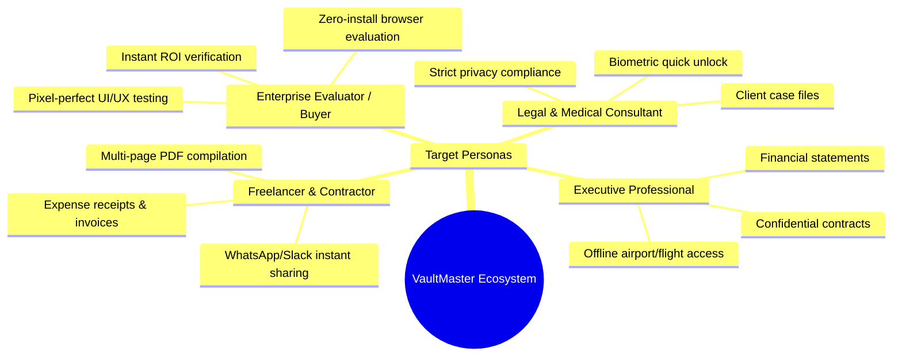

# Product Requirements Document (PRD) — VaultMaster

## 1. Executive Summary & Value Proposition
**VaultMaster** is a secure, offline-first mobile and web ecosystem designed to transform how individuals and professionals digitize, organize, and protect confidential physical and digital documents. Combining real-time machine learning edge detection (`Google ML Kit`), biometric/PIN keychain encryption (`flutter_secure_storage` & `SQLCipher`), and resilient background cloud synchronization (`Cloudinary` & `Firebase`), VaultMaster delivers a "pocket filing cabinet built for military-grade security."

To accelerate user acquisition and buyer engagement without requiring app installation or backend credentials, the project features a **Pixel-to-Pixel Interactive Web Sandbox (`website/demo.html`)** that precisely simulates the mobile application's Material 3 design, custom animations, and core user journeys directly inside a responsive browser smartphone mockup.

### Core Value Propositions:
- **🔒 True Offline-First Architecture**: Full local scanning, categorization, full-text search, and PIN protection operate with zero internet latency or dependence on external servers.
- **📸 Intelligent Camera Capture**: Real-time edge detection, automatic perspective correction, and multi-page PDF compilation powered by ML Kit Vision.
- **🗝️ Biometric & PIN Vault Security**: Hardware-backed OS keychain encryption (`AES-GCM`) that automatically locks upon app backgrounding, pause, or screen sleep.
- **⚡ Zero-Friction Web Sandbox**: Instant interactive browser demo replicating exact startup animations (`WelcomeScreen` rotating dial & `SplashScreen` scaling icon) and document management workflows for prospective buyers and evaluators.

---

## 2. Target User Personas & Mindmap

### Persona Descriptions:
1. **Arthur (The Legal Executive / P0 Persona)**: Travels frequently, handles NDAs and court filings. Needs instant offline scanning with guaranteed local encryption that prevents cloud leaks.
2. **Elena (The Mobile Freelancer / P1 Persona)**: Scans dozens of multi-page expense receipts weekly. Requires fast edge detection, semantic color-coded categories, and one-click PDF export to accounting tools.
3. **Marcus (The Software Buyer / P2 Persona)**: Evaluating document management solutions for his team. Needs to test the UI, animations, and security flows in seconds on desktop via the interactive web sandbox before committing to APK deployment.

---

## 3. Prioritized Feature Requirements

| Priority | Feature Module | Description | Target Platform |
| :--- | :--- | :--- | :--- |
| **P0 (Critical)** | **Local Vault Engine** | PIN/Biometric authentication with `AES-GCM` encryption and automatic session lock when app goes to background. | Flutter Mobile (Android/iOS) |
| **P0 (Critical)** | **ML Kit Smart Scanner** | Live camera edge detection, auto-crop perspective transformation, and multi-page PDF generation. | Flutter Mobile (Android/iOS) |
| **P0 (Critical)** | **Interactive Web Sandbox** | Exact HTML/CSS/JS Material 3 simulation with `WelcomeScreen` rotating dial, `SplashScreen` (`icon.png`), and document CRUD. | Web (`website/demo.html`) |
| **P1 (High)** | **Offline Categorization & Search** | Semantic color-coded folders (`Work`, `Personal`, `Legal`, `Finance`) and lightning-fast in-memory title search. | Flutter Mobile & Web Sandbox |
| **P1 (High)** | **Background Cloud Sync** | Batch upload queue to Cloudinary/Firebase that auto-pauses on network loss and resumes on reconnection. | Flutter Mobile |
| **P2 (Medium)** | **Native Share Sheet** | Direct exporting of encrypted PDFs and images to WhatsApp, Slack, Gmail, and Google Drive via OS share sheet. | Flutter Mobile |

---

## 4. User Stories & Acceptance Criteria

### US-01: Onboarding Welcome Screen Rotation
**As a** first-time user launching the app or interactive demo,  
**I want to** see a clean welcome screen with an animated rotating safe wheel,  
**So that** I immediately understand the product's focus on premium security and craftsmanship.

- **Given** the user launches `WelcomeScreen.dart` (or `demo.html` initial view),
- **When** the screen renders,
- **Then** a double-bordered outer frame (`160x160px`) with 4 corner rivets is displayed,
- **And** an inner safe dial (`_VaultPainter` / `.vault-rotating-wheel`) with 8 ticking notches smoothly rotates 360 degrees continuously over a 15-second loop (`@keyframes rotateWheel`),
- **And** clicking **GET STARTED** transitions smoothly to the Login screen.

### US-02: Google Authentication & Animated Splash Transition
**As a** user signing in with Google,  
**I want to** experience a smooth transition through the branded splash screen,  
**So that** I know my secure cloud archive is being synced before landing on the dashboard.

- **Given** the user is on the Login screen (`LoginScreen.dart` / `#flutter-screen-login`),
- **When** they tap **CONTINUE WITH GOOGLE**,
- **Then** the button text updates to `AUTHENTICATING...` for 500ms,
- **And** the application transitions to `SplashScreen.dart` (`#flutter-screen-splash`) displaying the actual app icon (`assets/icon.png`) with a cubic-bezier scale (`0.7 -> 1.0`) and fade animation alongside the subtitle `Syncing Nexus Archive...`,
- **And** after 2.2 seconds, the user is navigated to the Security Dashboard with a floating toast notification `✅ OK you are sign in`.

### US-03: PIN Verification & Vault Unlock
**As an** authenticated user accessing the private vault,  
**I want to** enter my 4-digit PIN using a secure keypad,  
**So that** only authorized individuals can view encrypted documents.

- **Given** the user attempts to open the `Security Vault` (`VaultPinScreen.dart` / `#flutter-screen-vault`),
- **When** they enter the correct 4-digit PIN (`1234`) via the on-screen keypad (`.pin-key`),
- **Then** each digit entry highlights a dot indicator (`.pin-dot.filled`),
- **And** upon entering the 4th digit, the system validates the hash and unlocks the vault view (`#flutter-screen-vault-unlocked`),
- **And** if the PIN is incorrect, the dots vibrate/shake and reset with an error toast.

### US-04: Smart Document Scanning & PDF Compilation
**As a** mobile professional scanning paper documents,  
**I want to** capture clean pages with automatic edge detection,  
**So that** I don't have to manually crop or straighten skewed images.

- **Given** the user opens the `Document Scanner` (`DocumentScanner.dart` / `#flutter-screen-scanner`),
- **When** the camera viewfinder focuses on a physical document,
- **Then** a pulsing cyan bounding box (`.scanner-overlay`) highlights detected corners,
- **And** pressing the capture button snaps the frame, applies perspective correction, and increments the page count badge (`Pages: 1`),
- **And** clicking **Save as PDF** opens the ingestion categorization menu.

### US-05: Smart Categorization & Ingestion Guardrails
**As a** user saving a newly scanned or imported file,  
**I want to** assign a custom title and category folder,  
**So that** my repository remains organized and easily searchable.

- **Given** the user is in the creation/ingestion modal (`IngestionMenu.dart` / `#flutter-modal-ingest`),
- **When** they enter a document title (`e.g., NDA_Contract_2026`) and select a category chip (`Work`, `Legal`, `Personal`),
- **And** they click **Encrypt & Save to Vault**,
- **Then** the system verifies the title is not blank (preventing empty record creation per guardrails),
- **And** the document is appended to the active repository (`#flutter-doc-list`) with its corresponding category badge, file size, and timestamp.

### US-06: Instant In-Memory Document Search & Category Filtering
**As a** user with dozens of stored files,  
**I want to** filter by category and type keywords into a search bar,  
**So that** I can locate specific documents instantly without waiting for network queries.

- **Given** the user is on the Security Dashboard (`DashboardScreen.dart` / `#flutter-screen-dashboard`),
- **When** they tap a category filter chip (`Work`) and enter a query (`contract`) into the search field (`#flutter-search`),
- **Then** the document list updates in real-time (`< 16ms` render loop) to show only records whose title matches the substring and whose category matches the active chip.

### US-07: Automatic Session Lock on Backgrounding
**As a** security-conscious user leaving the app temporarily,  
**I want to** have my session locked immediately,  
**So that** someone picking up my device cannot view open documents.

- **Given** the user has unlocked the `Security Vault` or dashboard,
- **When** the app lifecycle transitions to `AppLifecycleState.paused` or `AppLifecycleState.inactive` (or window blurs in sandbox simulation),
- **Then** the active session state is invalidated (`isVaultUnlocked = false`),
- **And** returning to the app immediately routes the user to `VaultPinScreen.dart` (or `WelcomeScreen.dart`).

### US-08: Sandbox Sign Out & Flow Replay
**As a** software evaluator demonstrating the web sandbox,  
**I want to** sign out cleanly from the dashboard,  
**So that** I can show the onboarding and login animations from the very beginning to stakeholders.

- **Given** the user is on the Security Dashboard (`#flutter-screen-dashboard`),
- **When** they click the **Sign Out** button (`logoutSandbox()`),
- **Then** a floating snackbar displays `Signed out of Nexus Archive.`,
- **And** the `SplashScreen` appears for 1.6 seconds showing `Logging out...`,
- **And** the user is returned to the `WelcomeScreen` (`#flutter-screen-welcome`) where the rotating safe wheel is playing.

### US-09: Offline Cloud Sync Queue
**As a** mobile user without active Wi-Fi,  
**I want to** scan and save documents offline with automatic upload queuing,  
**So that** my files are backed up safely when connectivity is restored.

- **Given** the device has no network connection (`ConnectivityResult.none`),
- **When** the user saves a new document to the vault,
- **Then** the document is written to local `SQLCipher` storage with `sync_status = 'pending'`,
- **And** once network connectivity returns (`ConnectivityResult.wifi`), a background task uploads the encrypted blob to Cloudinary and updates `sync_status = 'synced'`.

### US-10: Pixel-to-Pixel Web Demo Parity
**As a** prospective customer browsing the product website (`demo.html`),  
**I want to** test all app screens inside an interactive smartphone frame without downloading an APK,  
**So that** I can experience the exact typography, colors, borders, and micro-animations of the native app.

- **Given** the user opens `https://aliahmedoo5.github.io/VaultMaster/demo.html`,
- **When** interacting with the phone frame (`#sandbox-view`),
- **Then** all screens (`Welcome`, `Login`, `Splash`, `Dashboard`, `Scanner`, `PIN Vault`) render exclusively without mode tabs or external web app iframe fallbacks,
- **And** all buttons, back arrows (`←`), modals, and toasts respond exactly as defined in the Flutter Material 3 design system.

---

## 5. Non-Functional Requirements (NFRs)

1. **Performance & Rendering**:
   - Flutter mobile app must sustain `60 FPS` (`120 FPS` on ProMotion displays) during all custom transitions (`_VaultPainter`, `SplashScreen` scaling).
   - Web sandbox (`demo.html`) must load in under `1.2 seconds` on standard broadband and execute zero external JS framework dependencies (pure Vanilla JS and CSS v4/vanilla variables).
2. **Security & Cryptography**:
   - All sensitive data keys stored via `flutter_secure_storage` utilizing `EncryptedSharedPreferences` on Android and `Keychain` on iOS (`AES-GCM-256`).
   - SQLite local databases encrypted using `SQLCipher` with PBKDF2 key derivation.
3. **Accessibility & Responsive Parity**:
   - Interactive web sandbox must remain fully accessible across desktop, tablet, and mobile browsers (`min-width: 320px` up to `4K` displays) with responsive scaling of the smartphone mockup container (`.phone-mockup-wrapper`).
