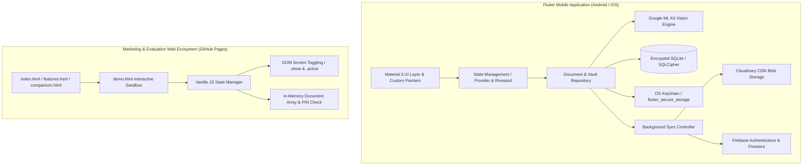
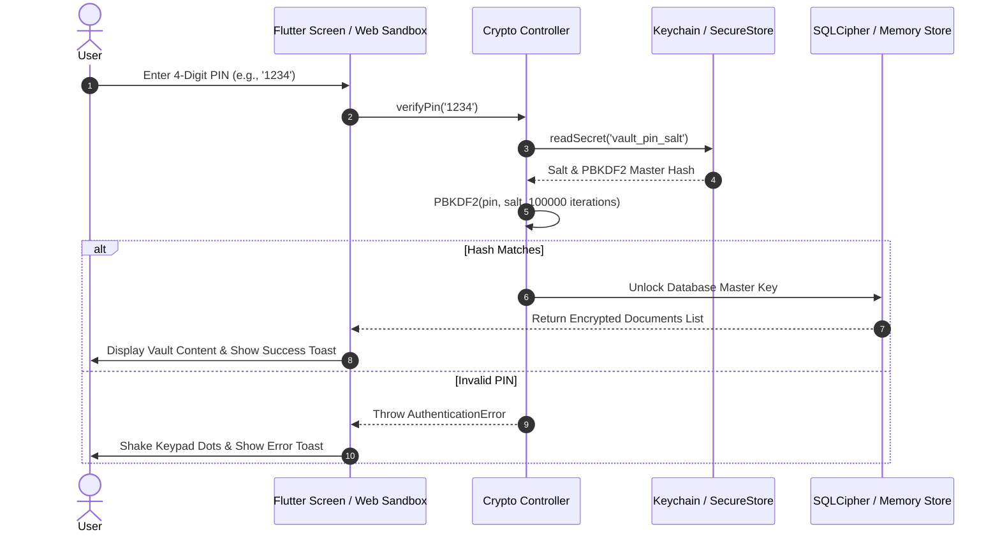

# Technical Requirements Document (TRD) — VaultMaster

## 1. System Architecture Overview

VaultMaster utilizes a hybrid dual-engine architecture: a high-performance **Offline-First Flutter Mobile Application** for native Android/iOS deployments, and an **Interactive Vanilla HTML/CSS/JS Sandbox (`website/demo.html`)** for instant zero-install browser evaluation.



---

## 2. Technology Stack & Exact Versions

| Layer / Component | Technology / Library | Exact Version / Spec | Purpose |
| :--- | :--- | :--- | :--- |
| **Mobile Core** | Flutter SDK & Dart | Flutter `>=3.22.0`, Dart `>=3.4.0` | Cross-platform native compilation for Android and iOS. |
| **ML Edge Detection** | `google_mlkit_document_scanner` | `^0.2.0` | Real-time edge detection, perspective transformation, and cropping. |
| **Secure Key Storage** | `flutter_secure_storage` | `^9.2.2` | Keychain/Keystore hardware-backed `AES-GCM` key encryption. |
| **Local Database** | `sqflite_sqlcipher` | `^3.1.0` | Encrypted SQLite database engine (`PBKDF2` key derivation). |
| **Cloud Blob Storage** | `cloudinary_public` | `^0.23.1` | Direct-from-client encrypted file and PDF backup uploads. |
| **Navigation & Routing**| `go_router` | `^14.2.0` | Declarative URL-based navigation and auth guard redirects. |
| **Web Styling** | Vanilla CSS (`style.css`) | CSS3 / v4 Variables | Pure custom design system without heavy CSS framework bloat. |
| **Web Sandbox Logic** | Vanilla JavaScript (`demo.html`) | ES2023 | In-memory state management, screen transitions, and animations. |
| **CI/CD & Hosting** | GitHub Actions & GitHub Pages | Node `>=22`, Java `21` | Automated static website and APK release pipeline. |

---

## 3. Directory Tree & Workspace Layout

```
E:\Projects\vaultmaster\
├── android/                   # Native Android project configuration
├── ios/                       # Native iOS project configuration
├── assets/                    # Shared app assets (icon.png, logo.png, fonts)
├── docs/                      # 5-Part Senior Dev Documentation Suite
│   ├── 01_prd.md              # Product Requirements Document
│   ├── 02_trd.md              # Technical Requirements Document
│   ├── 03_user_flows.md       # User Flows & Screen Map
│   ├── 04_project_plan.md     # Implementation Plan & Milestones
│   └── 05_testing_plan.md     # QA & Testing Plan
├── lib/                       # Flutter Mobile Application Codebase
│   ├── main.dart              # Application entrypoint & global providers
│   ├── core/
│   │   ├── theme.dart         # Material 3 Design System (`AppTheme`)
│   │   └── constants.dart     # Layout padding, radius, and timing constants
│   └── features/
│       ├── auth/
│       │   ├── presentation/
│       │   │   ├── welcome_screen.dart   # Screen 0: Rotating dial (`_VaultPainter`)
│       │   │   └── login_screen.dart     # Screen 1: Google & Email Authentication
│       ├── splash/
│       │   └── presentation/
│       │       └── splash_screen.dart    # Screen 2: Animated icon scale/fade transition
│       ├── dashboard/
│       │   └── presentation/
│       │       └── dashboard_screen.dart # Screen 3: Document list, search & categories
│       ├── vault/
│       │   └── presentation/
│       │       └── vault_pin_screen.dart # Screen 4: 4-digit PIN verification keypad
│       └── scanner/
│           └── presentation/
│               ├── document_scanner.dart # Screen 5: ML Kit camera viewfinder overlay
│               └── ingestion_menu.dart   # Screen 6: Category assignment & save modal
└── website/                   # Product Marketing & Evaluation Website
    ├── index.html             # Hero landing page & feature highlights
    ├── features.html          # Detailed breakdown of 6 core capabilities
    ├── comparison.html        # Competitive matrix (vs Google Drive, CamScanner)
    ├── docs.html              # User guide & technical specifications
    ├── demo.html              # Exclusive Pixel-to-Pixel Interactive Sandbox
    ├── style.css              # Global design system (`--flutter-primary`, `@keyframes`)
    └── assets/                # Web media assets (icon.png, hero-mockup.jpg)
```

---

## 4. Data Schemas & Models

### 4.1 SQLCipher Database Schema (`documents_table`)
```sql
CREATE TABLE IF NOT EXISTS documents (
    id TEXT PRIMARY KEY,
    title TEXT NOT NULL,
    category TEXT NOT NULL CHECK(category IN ('Work', 'Personal', 'Legal', 'Finance', 'Uncategorized')),
    file_path TEXT NOT NULL,
    file_size_bytes INTEGER NOT NULL,
    mime_type TEXT NOT NULL,
    is_encrypted BOOLEAN DEFAULT 1,
    encryption_iv TEXT NOT NULL,
    cloud_url TEXT NULL,
    sync_status TEXT DEFAULT 'pending' CHECK(sync_status IN ('pending', 'uploading', 'synced', 'error')),
    created_at INTEGER NOT NULL,
    updated_at INTEGER NOT NULL
);

CREATE INDEX idx_category ON documents(category);
CREATE INDEX idx_title ON documents(title);
```

### 4.2 TypeScript / Dart Entity Interface (`VaultDocument`)
```typescript
export type DocumentCategory = 'Work' | 'Personal' | 'Legal' | 'Finance' | 'Uncategorized';
export type SyncStatus = 'pending' | 'uploading' | 'synced' | 'error';

export interface VaultDocument {
  id: string;               // UUIDv4
  title: string;            // Document display title
  category: DocumentCategory;
  filePath: string;         // Local absolute path to encrypted blob
  fileSizeBytes: number;    // Size in bytes
  mimeType: string;         // 'application/pdf' | 'image/jpeg' | 'text/plain'
  isEncrypted: boolean;     // True for items in secure vault
  encryptionIv: string;     // Base64 encoded Initialization Vector for AES-GCM
  cloudUrl?: string;        // Cloudinary download URL once uploaded
  syncStatus: SyncStatus;   // Background synchronization state
  createdAt: number;        // Epoch timestamp (ms)
  updatedAt: number;        // Epoch timestamp (ms)
}
```

---

## 5. Security & Cryptographic Guardrails



### Critical Security Rules:
1. **Empty Record Prevention (`!title.trim() && !content.trim()`)**:
   Any creation modal or auto-save hook (`IngestionMenu.dart` or `demo.html` modal) strictly checks if the entity is empty before persisting. Opening and closing a creation modal without user input immediately discards the transaction without writing blank or generic records.
2. **Smart Title Fallback**:
   When a user inputs OCR content or file data without explicitly typing a title, the system infers the title from the first line of content (up to 40 characters cleaned of punctuation) rather than defaulting to `"Untitled"`.
3. **Session Invalidation on Lifecycle Blur**:
   If the mobile OS triggers `AppLifecycleState.paused` or `AppLifecycleState.inactive`, all decrypted memory buffers (`Uint8List`) are wiped immediately, and the navigation stack pushes `VaultPinScreen` to the foreground.

---

## 6. Web Sandbox Architecture (`demo.html`)

The interactive web sandbox achieves exact visual and behavioral parity with the Flutter app through rigorous DOM structuring and CSS variables:

- **Screen Container Registry (`#sandbox-view`)**:
  All screens (`#flutter-screen-welcome`, `#flutter-screen-login`, `#flutter-screen-splash`, `#flutter-screen-dashboard`, `#flutter-screen-vault`, `#flutter-screen-scanner`) exist in the DOM inside `.phone-frame`. Only one screen has the `active` class at any time; others have `hidden`.
- **CSS Transitions & Keyframes**:
  - `WelcomeScreen`: Uses pure CSS `@keyframes rotateWheel` rotating `.vault-rotating-wheel` `360deg` continuously every 15 seconds.
  - `SplashScreen`: Uses dual `transform: scale(0.7) -> scale(1.0)` and `opacity: 0 -> 1` when the `.animate` class is injected via JavaScript timeout (`runSplashScreen`).
- **In-Memory State (`DEMO_DOCS` & `DEMO_CATEGORIES`)**:
  JavaScript maintains an array of mock documents (`Nexus_Security_Protocol.pdf`, `Q4_Tax_Returns_2025.xlsx`, etc.). Adding a document or searching updates the DOM immediately without network requests.
