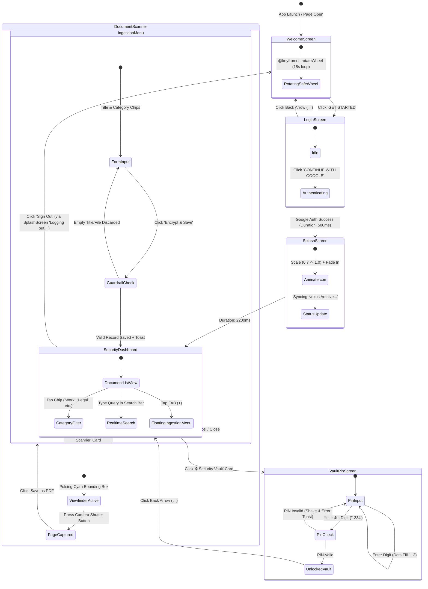
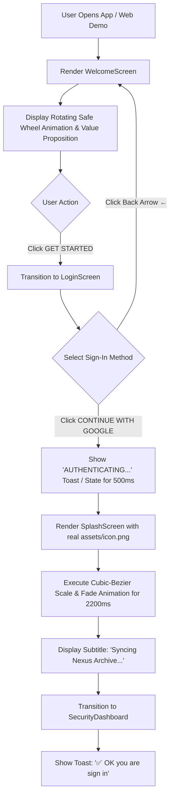
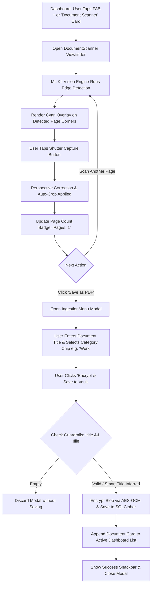
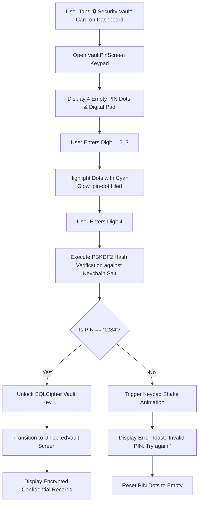
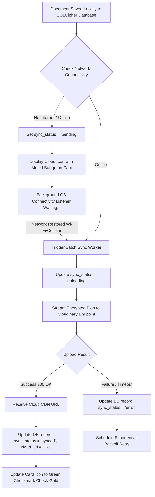

# User Flows & Screen Map — VaultMaster

## 1. Application Screen Map (Mermaid State Graph)

This graph maps the exact navigation state transitions across the VaultMaster mobile application (`lib/features/`) and the web sandbox simulation (`website/demo.html`).

---

## 2. Core Workflow Flowcharts

### 2.1 Onboarding & Authentication Flow (`Welcome` -> `Login` -> `Splash` -> `Dashboard`)

### 2.2 Document Scanning & Categorization Flow (`Scanner` -> `Ingestion` -> `Dashboard`)

### 2.3 Security Vault Verification Flow (`PIN Keypad` -> `Unlocked Vault`)

### 2.4 Offline Cloud Sync Queue Flow

---

## 3. Edge Cases & Exception Handling

1. **App Backgrounding During Active Scanning**:
   - *Trigger*: User receives a phone call while `DocumentScanner` is open with 3 pages captured.
   - *Handling*: The un-ingested page buffers (`temp_page_1..3.jpg`) are cached inside the application temporary directory (`getTemporaryDirectory()`). Upon returning, the scanner restores the session and page count badge without data loss.
2. **Missing Document Title on Save**:
   - *Trigger*: User leaves the title input blank in `IngestionMenu` after scanning a tax form.
   - *Handling*: Per user guardrails (`Smart Title Fallback`), the system extracts the first line of OCR text (e.g., `Form 1040 Individual Income Tax`) and applies it as the record title. If no OCR text exists, it generates a timestamped name (`Scan_2026-07-17_2048`).
3. **Repeated Invalid PIN Attempts**:
   - *Trigger*: User enters an incorrect PIN more than 5 consecutive times on `VaultPinScreen`.
   - *Handling*: The keypad triggers an exponential lockout timer (`30s -> 60s -> 5m`) and logs a security warning toast (`Too many attempts. Keypad locked for 30s.`).
