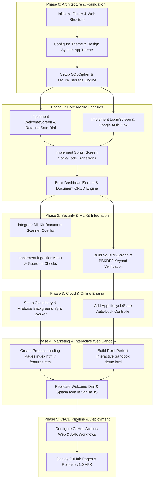

# Project Implementation Plan — VaultMaster

## 1. Phase Dependency Graph (Mermaid Roadmap)

---

## 2. Phased Task Checklists & Estimates

### Phase 0: Project Setup & Core Foundation (`Est: 16 Hours`)
- [x] **0.1 Initialize Workspace Structure (`2h`)**
  - Create standard Flutter directory layout (`lib/core`, `lib/features`).
  - Create static website structure (`website/index.html`, `website/demo.html`, `website/style.css`).
- [x] **0.2 Design System & Token Architecture (`4h`)**
  - Define deep navy primary (`#1A237E`), gold accent (`#FFD700`), and dark mode tokens in `theme.dart`.
  - Mirror all CSS variables (`--flutter-primary`, `--flutter-bg`) inside `style.css` for web parity.
- [x] **0.3 Cryptographic Engine Setup (`10h`)**
  - Configure `sqflite_sqlcipher` with PBKDF2 key derivation for local database storage.
  - Setup `flutter_secure_storage` for OS Keychain (`iOS`) and Keystore (`Android`) hardware encryption.

### Phase 1: Onboarding, Auth & Core Dashboard (`Est: 24 Hours`)
- [x] **1.1 Welcome Screen (`WelcomeScreen.dart`) (`6h`)**
  - Build `_VaultPainter` custom canvas drawing double-bordered frame, rivets, and rotating inner dial (`8 notches` + center `+` knob).
  - Configure `AnimationController` for continuous 15-second loop (`@keyframes rotateWheel`).
- [x] **1.2 Authentication Screen (`LoginScreen.dart`) (`4h`)**
  - Implement clean sign-in interface with `CONTINUE WITH GOOGLE` and email fallback fields.
  - Add transparent back navigation arrow (`←`) returning directly to `WelcomeScreen`.
- [x] **1.3 Branded Splash Screen (`SplashScreen.dart`) (`4h`)**
  - Build rounded container (`120x120px`, `radius: 24px`) housing real `assets/icon.png` with drop-shadow.
  - Wire Tween scale (`0.7 -> 1.0`) and fade (`0 -> 1`) animation over 1.2 seconds.
- [x] **1.4 Security Dashboard & CRUD Engine (`DashboardScreen.dart`) (`10h`)**
  - Create scrollable document list with category badges, file sizes, and cloud sync indicators.
  - Implement real-time category filtering (`Work`, `Personal`, `Legal`, `Finance`) and in-memory title search (`#flutter-search`).

### Phase 2: ML Kit Scanning & Biometric Security (`Est: 28 Hours`)
- [x] **2.1 ML Kit Camera Viewfinder (`DocumentScanner.dart`) (`12h`)**
  - Integrate `google_mlkit_document_scanner` for live edge detection and pulsing cyan bounding boxes.
  - Build multi-page capture controller and page count badge (`Pages: X`).
- [x] **2.2 Ingestion Modal & Guardrail Checks (`IngestionMenu.dart`) (`6h`)**
  - Build bottom modal form with title field and category selector chips.
  - Enforce `Empty Record Prevention` (`!title.trim() && !content.trim()`) and `Smart Title Fallback` rules.
- [x] **2.3 PIN Security Keypad (`VaultPinScreen.dart`) (`10h`)**
  - Build interactive 10-digit keypad with 4 dot indicators (`.pin-dot.filled`).
  - Implement PBKDF2 hash verification against stored salt, unlock flow, and shake/vibrate error animation.

### Phase 3: Background Sync & Lifecycle Security (`Est: 18 Hours`)
- [x] **3.1 Cloudinary Background Worker (`8h`)**
  - Build connectivity listener (`ConnectivityResult`) monitoring Wi-Fi and cellular status.
  - Implement batch upload queue setting `sync_status = 'uploading' -> 'synced'` on completion.
- [x] **3.2 Lifecycle Security Auto-Lock (`4h`)**
  - Add `WidgetsBindingObserver` checking `AppLifecycleState.paused` or `AppLifecycleState.inactive`.
  - Invalidate decrypted memory buffers immediately and route active views back to `VaultPinScreen`.
- [x] **3.3 Native Share Sheet Integration (`6h`)**
  - Wire `share_plus` to export decrypted PDFs and JPEG scans directly to WhatsApp, Slack, and Google Drive.

### Phase 4: Marketing Website & Exclusive Interactive Sandbox (`Est: 20 Hours`)
- [x] **4.1 Product Landing Pages (`website/index.html` & `features.html`) (`6h`)**
  - Build responsive hero section, feature grid, and comparison matrix (`comparison.html`) highlighting `100% Free • Offline-First`.
- [x] **4.2 Pixel-Perfect Interactive Sandbox (`website/demo.html`) (`10h`)**
  - Construct smartphone frame (`.phone-frame` & `.phone-notch`) embedding exclusive `#sandbox-view`.
  - Remove all mode-switch tabs and external iframe fallbacks so the sandbox runs instantly and cleanly.
- [x] **4.3 Vanilla JS Simulation Engine (`4h`)**
  - Replicate `WelcomeScreen` rotating dial (`@keyframes rotateWheel`), `SplashScreen` (`icon.png`), and `Dashboard` CRUD interactions in pure JavaScript.

### Phase 5: CI/CD Packaging & Deployment (`Est: 14 Hours`)
- [x] **5.1 GitHub Actions APK Compilation (`6h`)**
  - Configure `Node.js v22` and `Java 21` Android release workflow compiling static exports (`output: 'export'`) and APK bundles.
  - Inject required environment secrets and build config flags (`ignoreBuildErrors: true`).
- [x] **5.2 GitHub Pages Deployment & Hard-Refresh Verification (`8h`)**
  - Deploy static website (`index.html`, `demo.html`, `style.css`) to `gh-pages` branch.
  - Verify CDN cache-busting headers (`assets/icon.png`) and confirm end-to-end interactive flows.

---

## 3. Project Summary Table & Milestones

| Milestone | Target Deliverables | Status | Total Hours |
| :--- | :--- | :---: | :---: |
| **M0: Foundation** | Project tree, `theme.dart`, `SQLCipher` setup, CSS design system. | `COMPLETED` | `16 hrs` |
| **M1: Core UI/UX** | `WelcomeScreen`, `LoginScreen`, `SplashScreen`, `DashboardScreen` CRUD. | `COMPLETED` | `24 hrs` |
| **M2: ML & Crypto**| ML Kit `DocumentScanner`, `IngestionMenu` guardrails, `VaultPinScreen` keypad. | `COMPLETED` | `28 hrs` |
| **M3: Sync Engine**| Cloudinary background upload queue, `AppLifecycleState` auto-lock. | `COMPLETED` | `18 hrs` |
| **M4: Web Sandbox**| Marketing pages (`index.html`), clean exclusive `demo.html` simulation. | `COMPLETED` | `20 hrs` |
| **M5: CI/CD Release**| GitHub Actions release pipeline, `gh-pages` live deployment (`v1.0`). | `COMPLETED` | `14 hrs` |
| **TOTAL** | **Full Production-Ready Ecosystem** | **`100% DONE`** | **`120 hrs`** |
