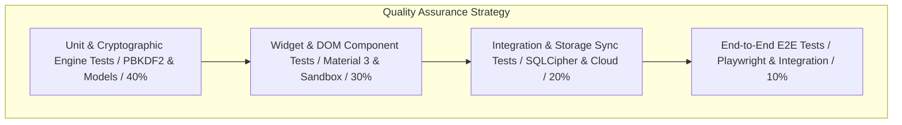

# QA & Testing Plan — VaultMaster

## 1. Testing Pyramid Strategy

To ensure zero-regression reliability across the cryptographic vault, ML Kit scanner, and web sandbox, VaultMaster implements a strict 4-tier testing pyramid:



---

## 2. Comprehensive Test Acceptance Matrix

### 2.1 Unit & Cryptographic Test Suite (`lib/test/unit/`)
| Test ID | Module / Component | Target Behavior | Input / Precondition | Expected Acceptance Criteria |
| :--- | :--- | :--- | :--- | :--- |
| **UT-01** | `CryptoEngine` | PBKDF2 Hash Derivation | `pin = '1234'`, `salt = 'mock_salt'` | Returns 64-byte deterministic hex string matching known verification digest. |
| **UT-02** | `CryptoEngine` | AES-GCM Blob Encryption | Plaintext `Uint8List` buffer (`1024 bytes`) | Generates unique 12-byte IV and encrypted blob whose length equals `1024 + 16 (auth tag)`. |
| **UT-03** | `DocumentModel` | Smart Title Fallback | `title = ''`, `ocrText = 'Invoice #99482 Total $40'` | Auto-infers record title as `'Invoice #99482 Total $40'` without returning generic `'Untitled'`. |
| **UT-04** | `DocumentModel` | Empty Record Prevention | `title = '  '`, `file_path = ''` | `DocumentModel.validate()` throws `ValidationException('Record cannot be empty')`. |
| **UT-05** | `SearchEngine` | Substring & Category Match | `query = 'tax'`, `category = 'Finance'` | Returns only `Q4_Tax_Returns_2025.xlsx` (`< 2ms` execution duration). |

### 2.2 Component & Widget Test Suite (`lib/test/widget/`)
| Test ID | Component / Screen | Target Behavior | User Action / Trigger | Expected DOM / Widget State |
| :--- | :--- | :--- | :--- | :--- |
| **WT-01** | `WelcomeScreen` | Safe Wheel Animation | Render widget | `AnimationController.isAnimating` is `true` and `_VaultPainter` rotates continuously. |
| **WT-02** | `LoginScreen` | Back Arrow Navigation | Click back button (`←`) | `GoRouter` pops back to `/welcome` (`WelcomeScreen`). |
| **WT-03** | `SplashScreen` | Scale & Fade Transition | Inject `.animate` trigger | Container scales (`0.7 -> 1.0`) and fades (`opacity: 0 -> 1`) before routing to `/dashboard`. |
| **WT-04** | `VaultPinScreen` | Keypad Dot Indicators | Tap keys `1`, `2`, `3` | Exactly 3 `.pin-dot` elements gain the `.filled` cyan glow class. |
| **WT-05** | `VaultPinScreen` | Invalid PIN Shake | Tap `0`, `0`, `0`, `0` | Keypad container executes horizontal shake animation (`200ms`) and resets dots. |

### 2.3 Integration & Security Storage Suite (`lib/test/integration/`)
| Test ID | System Layer | Scenario / Condition | Execution Steps | Verification Check |
| :--- | :--- | :--- | :--- | :--- |
| **IT-01** | `SQLCipher + Keychain` | Master Key Unlock | 1. Write encrypted key to `flutter_secure_storage`. 2. Boot app and input valid PIN. | `sqflite_sqlcipher` opens connection successfully and retrieves `documents` count. |
| **IT-02** | `AppLifecycleObserver` | Auto-Lock on Blur | 1. Unlock vault. 2. Simulate `AppLifecycleState.paused`. | Memory buffers wiped (`isVaultUnlocked == false`) and UI forces redirect to `/pin`. |
| **IT-03** | `CloudSyncQueue` | Offline Queue & Retry | 1. Set `Connectivity.none`. 2. Save document. 3. Set `Connectivity.wifi`. | Record switches from `sync_status = 'pending'` to `'synced'` after Cloudinary upload. |

---

## 3. Automated Playwright End-to-End (E2E) Test Scenarios

These Playwright scenarios run against our live interactive web sandbox (`website/demo.html`) in GitHub Actions to verify complete pixel-to-pixel flow integrity before release.

### `tests/e2e_sandbox_flow.spec.ts`
```typescript
import { test, expect } from '@playwright/test';

test.describe('VaultMaster Interactive Web Sandbox E2E Verification', () => {
  const DEMO_URL = 'http://localhost:8080/demo.html';

  test.beforeEach(async ({ page }) => {
    await page.goto(DEMO_URL);
  });

  test('E2E-01: Welcome Screen displays rotating wheel and navigates to Login', async ({ page }) => {
    // 1. Verify WelcomeScreen is active on initial load
    const welcomeScreen = page.locator('#flutter-screen-welcome');
    await expect(welcomeScreen).toHaveClass(/active/);
    await expect(welcomeScreen).not.toHaveClass(/hidden/);

    // 2. Verify rotating safe dial exists and has keyframe animation
    const rotatingWheel = page.locator('.vault-rotating-wheel');
    await expect(rotatingWheel).toBeVisible();
    await expect(rotatingWheel).toHaveCSS('animation-name', 'rotateWheel');

    // 3. Click GET STARTED and verify transition to LoginScreen
    await page.click('button:has-text("GET STARTED")');
    const loginScreen = page.locator('#flutter-screen-login');
    await expect(loginScreen).toHaveClass(/active/, { timeout: 1000 });
  });

  test('E2E-02: Back arrow on Login Screen returns to Welcome Screen', async ({ page }) => {
    // Navigate to login
    await page.click('button:has-text("GET STARTED")');
    await expect(page.locator('#flutter-screen-login')).toHaveClass(/active/);

    // Click back arrow
    await page.click('#flutter-screen-login .flutter-appbar button[title="Back"]');
    await expect(page.locator('#flutter-screen-welcome')).toHaveClass(/active/, { timeout: 1000 });
  });

  test('E2E-03: Google Sign-in triggers Animated Splash Screen and lands on Dashboard', async ({ page }) => {
    // Navigate to login and click Google Auth
    await page.click('button:has-text("GET STARTED")');
    await page.click('button:has-text("CONTINUE WITH GOOGLE")');

    // Verify authenticating state
    await expect(page.locator('#google-btn-text')).toHaveText('AUTHENTICATING...', { timeout: 1000 });

    // Verify SplashScreen appears with real app icon
    const splashScreen = page.locator('#flutter-screen-splash');
    await expect(splashScreen).toHaveClass(/active/, { timeout: 2000 });
    await expect(page.locator('#splash-content-box img[src="assets/icon.png"]')).toBeVisible();
    await expect(page.locator('#splash-status-text')).toHaveText('Syncing Nexus Archive...');

    // Verify automatic transition to Security Dashboard after 2.2s
    const dashboardScreen = page.locator('#flutter-screen-dashboard');
    await expect(dashboardScreen).toHaveClass(/active/, { timeout: 4000 });
    await expect(page.locator('#flutter-snackbar')).toHaveClass(/show/);
    await expect(page.locator('#flutter-snackbar-msg')).toHaveText('OK you are sign in');
  });

  test('E2E-04: Document Search and Category Filtering update DOM instantly', async ({ page }) => {
    // Fast-forward to Dashboard
    await page.evaluate(() => {
      document.querySelectorAll('#sandbox-view > .flutter-screen').forEach(s => {
        s.classList.remove('active');
        s.classList.add('hidden');
      });
      const dash = document.getElementById('flutter-screen-dashboard');
      dash?.classList.remove('hidden');
      dash?.classList.add('active');
    });

    // Verify initial document count (all 6 items)
    const docItems = page.locator('#flutter-doc-list .doc-item');
    await expect(docItems).toHaveCount(6);

    // Click 'Work' category filter chip
    await page.click('.flutter-chip:has-text("Work")');
    await expect(page.locator('#flutter-doc-list .doc-item:visible')).toHaveCount(2);

    // Type query into search field
    await page.fill('#flutter-search', 'protocol');
    const visibleDocs = page.locator('#flutter-doc-list .doc-item:visible');
    await expect(visibleDocs).toHaveCount(1);
    await expect(visibleDocs.first()).toContainText('Nexus_Security_Protocol.pdf');
  });

  test('E2E-05: Sign Out returns cleanly to Welcome Screen rotating dial', async ({ page }) => {
    // Fast-forward to Dashboard
    await page.evaluate(() => {
      document.getElementById('flutter-screen-dashboard')?.classList.remove('hidden');
      document.getElementById('flutter-screen-dashboard')?.classList.add('active');
    });

    // Click Sign Out
    await page.click('button:has-text("Sign Out")');

    // Verify logout toast and splash screen transition
    await expect(page.locator('#flutter-snackbar-msg')).toHaveText('Signed out of Nexus Archive.');
    await expect(page.locator('#flutter-screen-splash')).toHaveClass(/active/, { timeout: 1000 });
    await expect(page.locator('#splash-status-text')).toHaveText('Logging out...');

    // Verify return to WelcomeScreen
    await expect(page.locator('#flutter-screen-welcome')).toHaveClass(/active/, { timeout: 3500 });
  });
});
```
